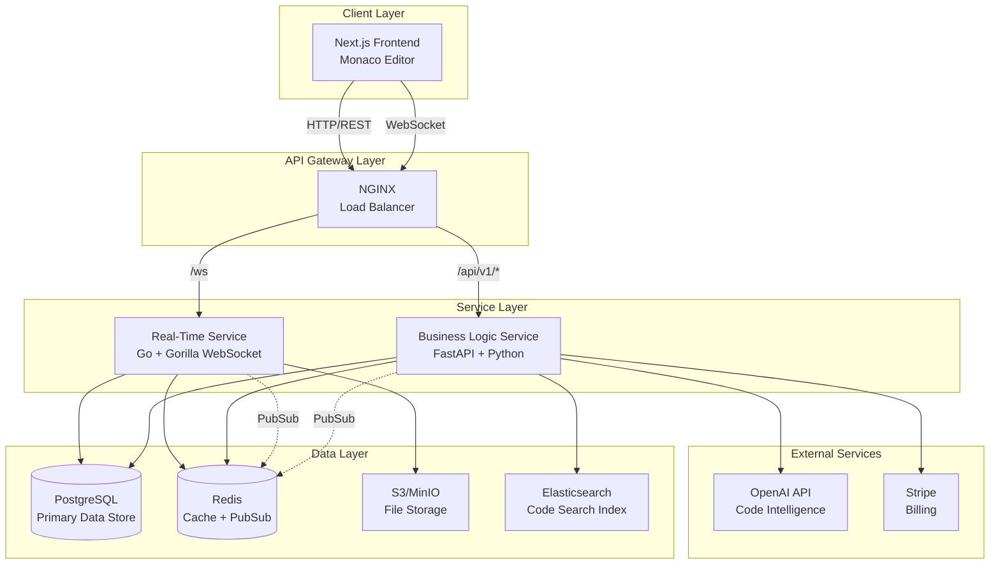
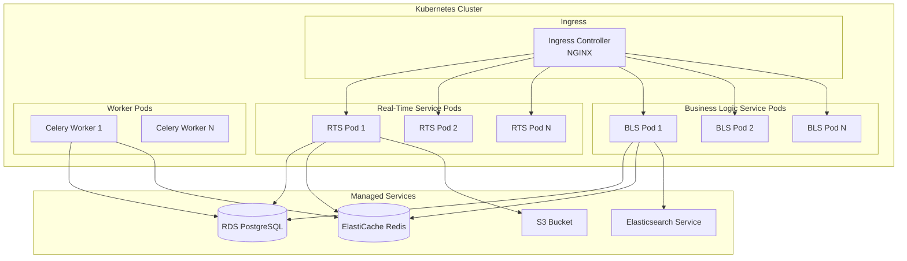

# Design Document: CodeCollab Backend Platform

## Overview

The CodeCollab Backend Platform is a dual-service architecture supporting real-time collaborative code editing. The system consists of:

1. **Real-Time Service (Go)**: Handles WebSocket connections, collaborative editing with operational transforms, file system operations, terminal execution, user presence tracking, and team chat
2. **Business Logic Service (FastAPI/Python)**: Manages authentication, project CRUD operations, AI-powered features (code completion, explanation, bug detection), billing, search indexing, and user management

The services communicate through a shared PostgreSQL database and Redis cache. The Real-Time Service prioritizes low-latency operations (<100ms for collaboration events), while the Business Logic Service handles computationally intensive operations like AI inference and search indexing.

### Key Design Decisions

**Why Go for Real-Time Service?**
- Excellent concurrency model with goroutines for handling 10,000+ concurrent WebSocket connections
- Low memory footprint and predictable latency
- Strong standard library support for WebSocket and file operations
- Native performance for operational transform algorithms

**Why FastAPI for Business Logic Service?**
- Rich Python ecosystem for AI/ML integration (OpenAI, Anthropic, Hugging Face)
- Fast development velocity for business logic
- Excellent async support for I/O-bound operations
- Strong typing with Pydantic for API validation

**Why Operational Transform over CRDT?**
- Smaller message size for real-time collaboration (critical for 100ms latency target)
- Simpler conflict resolution for text editing use case
- Well-established algorithms (OT.js, ShareDB)
- Better support for undo/redo operations

## Architecture

### System Architecture Diagram



### Service Communication Patterns

**Synchronous Communication:**
- Frontend → Business Logic Service: REST API for CRUD operations, authentication, AI features
- Frontend → Real-Time Service: WebSocket for collaborative editing, file operations, terminal

**Asynchronous Communication:**
- Real-Time Service ↔ Business Logic Service: Redis PubSub for cross-service events
  - User authentication events (login/logout)
  - Project permission changes
  - Subscription tier updates

**Data Consistency:**
- PostgreSQL as source of truth for all persistent data
- Redis for ephemeral data (sessions, presence, rate limiting)
- Eventual consistency between services via PubSub

### Deployment Architecture



**Scaling Strategy:**
- Real-Time Service: Horizontal scaling with sticky sessions (WebSocket affinity)
- Business Logic Service: Horizontal scaling with stateless pods
- Database: Vertical scaling with read replicas for analytics
- Redis: Cluster mode for high availability

## Components and Interfaces

### Real-Time Service Components (Go)

#### 1. WebSocket Manager

**Responsibility:** Manage WebSocket connections, authentication, and message routing

```go
type WebSocketManager struct {
    connections map[string]*Connection
    hub         *Hub
    upgrader    websocket.Upgrader
}

type Connection struct {
    ID          string
    UserID      string
    WorkspaceID string
    Conn        *websocket.Conn
    Send        chan []byte
}

// Authenticate validates JWT and establishes connection
func (m *WebSocketManager) Authenticate(token string) (*Connection, error)

// HandleMessage routes incoming messages to appropriate handlers
func (m *WebSocketManager) HandleMessage(conn *Connection, msg []byte) error

// Broadcast sends message to all connections in a workspace
func (m *WebSocketManager) Broadcast(workspaceID string, msg []byte) error

// Close terminates connection and cleanup
func (m *WebSocketManager) Close(connID string) error
```

**Key Features:**
- JWT validation on connection upgrade
- Heartbeat mechanism (30s interval, 10s timeout)
- Automatic reconnection handling
- Message compression for large payloads

#### 2. Operational Transform Engine

**Responsibility:** Apply operational transforms to resolve concurrent edits

```go
type OTEngine struct {
    documents map[string]*Document
    mutex     sync.RWMutex
}

type Document struct {
    ID       string
    Content  string
    Version  int64
    History  []Operation
}

type Operation struct {
    Type     string // "insert", "delete", "retain"
    Position int
    Text     string
    UserID   string
    Version  int64
}

// ApplyOperation applies an operation and transforms concurrent ops
func (e *OTEngine) ApplyOperation(docID string, op Operation) ([]Operation, error)

// Transform resolves conflicts between concurrent operations
func (e *OTEngine) Transform(op1, op2 Operation) (Operation, Operation, error)

// GetDocument retrieves current document state
func (e *OTEngine) GetDocument(docID string) (*Document, error)
```

**Algorithm:** Based on OT.js operational transform algorithm
- Insert/Delete/Retain operations
- Transform function for conflict resolution
- Version vector for causality tracking

#### 3. File System Manager

**Responsibility:** Handle file CRUD operations with validation and broadcasting

```go
type FileSystemManager struct {
    storage     Storage
    watcher     *FileWatcher
    broadcaster *WebSocketManager
}

type Storage interface {
    Read(path string) ([]byte, error)
    Write(path string, data []byte) error
    Delete(path string) error
    List(path string) ([]FileInfo, error)
}

// CreateFile creates a file and broadcasts event
func (m *FileSystemManager) CreateFile(workspaceID, path string, content []byte) error

// ReadFile reads file content with size validation
func (m *FileSystemManager) ReadFile(workspaceID, path string) ([]byte, error)

// UpdateFile updates file and broadcasts change
func (m *FileSystemManager) UpdateFile(workspaceID, path string, content []byte) error

// DeleteFile deletes file and broadcasts event
func (m *FileSystemManager) DeleteFile(workspaceID, path string) error

// ValidatePath prevents directory traversal attacks
func (m *FileSystemManager) ValidatePath(path string) error
```

**Security:**
- Path validation to prevent directory traversal
- File size limits (50MB per file)
- Workspace isolation
- Atomic write operations

#### 4. File Watcher

**Responsibility:** Monitor file system changes and broadcast updates

```go
type FileWatcher struct {
    watcher     *fsnotify.Watcher
    workspaces  map[string]*Workspace
    debouncer   *Debouncer
    broadcaster *WebSocketManager
}

// Watch starts monitoring a workspace directory
func (w *FileWatcher) Watch(workspaceID, path string) error

// HandleEvent processes file system events
func (w *FileWatcher) HandleEvent(event fsnotify.Event) error

// ShouldIgnore checks if file matches .gitignore patterns
func (w *FileWatcher) ShouldIgnore(path string) bool
```

**Features:**
- fsnotify for cross-platform file watching
- Debouncing (1 second window for batch changes)
- .gitignore pattern matching
- Recursive directory monitoring

#### 5. Terminal Manager

**Responsibility:** Execute shell commands in sandboxed environments

```go
type TerminalManager struct {
    sessions map[string]*TerminalSession
    sandbox  *Sandbox
}

type TerminalSession struct {
    ID          string
    UserID      string
    WorkspaceID string
    PTY         *os.File
    Cmd         *exec.Cmd
    LastActive  time.Time
}

// CreateSession spawns a new terminal session
func (m *TerminalManager) CreateSession(userID, workspaceID string) (*TerminalSession, error)

// ExecuteCommand runs a command and streams output
func (m *TerminalManager) ExecuteCommand(sessionID, command string) error

// Resize updates terminal dimensions
func (m *TerminalManager) Resize(sessionID string, rows, cols int) error

// Close terminates session
func (m *TerminalManager) Close(sessionID string) error
```

**Sandboxing:**
- Docker containers for isolation
- Resource limits (2GB memory, 4 CPU cores)
- Network restrictions (whitelist-based)
- Workspace directory mounting
- 30-minute idle timeout

#### 6. Presence Manager

**Responsibility:** Track user presence and cursor positions

```go
type PresenceManager struct {
    presence    map[string]*UserPresence
    broadcaster *WebSocketManager
    mutex       sync.RWMutex
}

type UserPresence struct {
    UserID      string
    WorkspaceID string
    Status      string // "active", "idle", "away"
    CurrentFile string
    Cursor      CursorPosition
    Selection   SelectionRange
    LastActive  time.Time
}

type CursorPosition struct {
    Line   int
    Column int
}

type SelectionRange struct {
    Start CursorPosition
    End   CursorPosition
}

// UpdatePresence updates user presence and broadcasts
func (m *PresenceManager) UpdatePresence(userID string, presence UserPresence) error

// GetPresence retrieves all users in a workspace
func (m *PresenceManager) GetPresence(workspaceID string) ([]UserPresence, error)

// CheckIdle updates status based on inactivity
func (m *PresenceManager) CheckIdle() error
```

**Status Transitions:**
- Active: Recent activity (<5 minutes)
- Idle: No activity for 5-15 minutes
- Away: No activity for >15 minutes

#### 7. Chat Manager

**Responsibility:** Handle real-time team chat messaging

```go
type ChatManager struct {
    messages    *MessageStore
    broadcaster *WebSocketManager
}

type Message struct {
    ID          string
    WorkspaceID string
    UserID      string
    Content     string
    Timestamp   time.Time
    Metadata    map[string]interface{}
}

// SendMessage validates and broadcasts chat message
func (m *ChatManager) SendMessage(msg Message) error

// GetHistory retrieves recent messages
func (m *ChatManager) GetHistory(workspaceID string, limit int) ([]Message, error)

// ValidateMessage checks message size and content
func (m *ChatManager) ValidateMessage(msg Message) error
```

**Features:**
- Message persistence in PostgreSQL
- 10KB message size limit
- Markdown formatting support
- Last 100 messages on join

### Business Logic Service Components (FastAPI)

#### 1. Authentication Service

**Responsibility:** Handle user authentication and JWT management

```python
class AuthService:
    def __init__(self, db: Database, redis: Redis):
        self.db = db
        self.redis = redis
        self.jwt_secret = settings.JWT_SECRET
        self.bcrypt_rounds = 12
    
    async def authenticate(self, email: str, password: str) -> TokenPair:
        """Authenticate user and return JWT tokens"""
        
    async def validate_token(self, token: str) -> UserClaims:
        """Validate JWT token and return claims"""
        
    async def refresh_token(self, refresh_token: str) -> TokenPair:
        """Generate new access token from refresh token"""
        
    async def hash_password(self, password: str) -> str:
        """Hash password using bcrypt"""
        
    async def verify_password(self, password: str, hash: str) -> bool:
        """Verify password against hash"""
```

**JWT Structure:**
```json
{
  "sub": "user_id",
  "email": "user@example.com",
  "role": "user",
  "tier": "pro",
  "exp": 1234567890,
  "iat": 1234567890
}
```

**Token Expiration:**
- Access token: 1 hour
- Refresh token: 30 days

#### 2. Project Service

**Responsibility:** Manage project CRUD operations and permissions

```python
class ProjectService:
    def __init__(self, db: Database, redis: Redis, storage: Storage):
        self.db = db
        self.redis = redis
        self.storage = storage
    
    async def create_project(self, user_id: str, project: ProjectCreate) -> Project:
        """Create new project with owner permissions"""
        
    async def get_project(self, project_id: str, user_id: str) -> Project:
        """Get project details with permission check"""
        
    async def update_project(self, project_id: str, user_id: str, 
                            update: ProjectUpdate) -> Project:
        """Update project settings"""
        
    async def delete_project(self, project_id: str, user_id: str) -> None:
        """Soft delete project and schedule cleanup"""
        
    async def list_projects(self, user_id: str, filters: ProjectFilters) -> List[Project]:
        """List projects where user has access"""
        
    async def check_permission(self, project_id: str, user_id: str, 
                              permission: str) -> bool:
        """Check if user has specific permission"""
```

#### 3. Collaboration Service

**Responsibility:** Manage project sharing and collaborator permissions

```python
class CollaborationService:
    def __init__(self, db: Database, redis: Redis, pubsub: PubSub):
        self.db = db
        self.redis = redis
        self.pubsub = pubsub
    
    async def invite_collaborator(self, project_id: str, inviter_id: str,
                                 email: str, role: str) -> Invitation:
        """Create collaboration invitation"""
        
    async def accept_invitation(self, invitation_id: str, user_id: str) -> None:
        """Accept invitation and grant access"""
        
    async def remove_collaborator(self, project_id: str, owner_id: str,
                                 user_id: str) -> None:
        """Remove collaborator and revoke access"""
        
    async def update_role(self, project_id: str, owner_id: str,
                         user_id: str, role: str) -> None:
        """Update collaborator role"""
        
    async def list_collaborators(self, project_id: str) -> List[Collaborator]:
        """List all project collaborators"""
```

**Roles and Permissions:**
- **Viewer**: Read-only access to files
- **Editor**: Read/write access to files
- **Admin**: Full access including collaborator management

#### 4. AI Service

**Responsibility:** Provide AI-powered code intelligence features

```python
class AIService:
    def __init__(self, openai_client: OpenAI, rate_limiter: RateLimiter):
        self.client = openai_client
        self.rate_limiter = rate_limiter
    
    async def complete_code(self, context: CodeContext) -> List[Completion]:
        """Generate code completion suggestions"""
        
    async def explain_code(self, code: str, language: str) -> Explanation:
        """Generate natural language explanation of code"""
        
    async def detect_bugs(self, code: str, language: str) -> List[Bug]:
        """Analyze code for potential bugs"""
        
    async def _build_prompt(self, template: str, **kwargs) -> str:
        """Build AI prompt from template"""
```

**Rate Limiting:**
- Code completion: 100 requests/minute per user
- Code explanation: 20 requests/hour per user
- Bug detection: 10 requests/hour per user

**Supported Languages:**
- Python, JavaScript, TypeScript, Go, Java, C++

#### 5. Search Service

**Responsibility:** Index and search code across projects

```python
class SearchService:
    def __init__(self, elasticsearch: Elasticsearch, db: Database):
        self.es = elasticsearch
        self.db = db
    
    async def index_project(self, project_id: str) -> None:
        """Index all files in a project"""
        
    async def search(self, project_id: str, query: SearchQuery) -> SearchResults:
        """Search code with filters"""
        
    async def update_file_index(self, project_id: str, file_path: str,
                               content: str) -> None:
        """Update index for a single file"""
        
    async def delete_file_index(self, project_id: str, file_path: str) -> None:
        """Remove file from index"""
```

**Search Features:**
- Exact match, case-insensitive, regex modes
- File type and directory filtering
- Result limit: 1,000 matches per query
- Performance target: <1 second for 100,000 files

#### 6. Billing Service

**Responsibility:** Manage subscriptions and usage tracking

```python
class BillingService:
    def __init__(self, stripe: StripeClient, db: Database):
        self.stripe = stripe
        self.db = db
    
    async def create_subscription(self, user_id: str, plan: str) -> Subscription:
        """Create new subscription via Stripe"""
        
    async def cancel_subscription(self, user_id: str) -> None:
        """Cancel subscription (end of billing period)"""
        
    async def update_subscription(self, user_id: str, plan: str) -> Subscription:
        """Upgrade or downgrade subscription"""
        
    async def track_usage(self, user_id: str, metric: str, amount: float) -> None:
        """Track usage metrics"""
        
    async def check_limits(self, user_id: str, metric: str) -> bool:
        """Check if user is within plan limits"""
        
    async def handle_webhook(self, event: StripeEvent) -> None:
        """Process Stripe webhook events"""
```

**Subscription Tiers:**
- **Free**: 1GB storage, 100 API requests/min, basic AI features
- **Pro**: 50GB storage, 1,000 API requests/min, full AI features
- **Enterprise**: Unlimited storage, unlimited API, priority support

#### 7. User Management Service

**Responsibility:** Manage user accounts and profiles

```python
class UserService:
    def __init__(self, db: Database, redis: Redis, email: EmailService):
        self.db = db
        self.redis = redis
        self.email = email
    
    async def create_user(self, user: UserCreate) -> User:
        """Create new user account"""
        
    async def get_user(self, user_id: str) -> User:
        """Get user details"""
        
    async def update_user(self, user_id: str, update: UserUpdate) -> User:
        """Update user profile"""
        
    async def deactivate_user(self, user_id: str) -> None:
        """Deactivate user account"""
        
    async def delete_user(self, user_id: str) -> None:
        """Anonymize and delete user data"""
        
    async def send_verification_email(self, user_id: str) -> None:
        """Send email verification link"""
```

### API Specifications

#### Real-Time Service WebSocket API

**Connection Endpoint:** `ws://api.codecollab.com/ws?token=<JWT>`

**Message Format:**
```json
{
  "type": "message_type",
  "payload": {},
  "timestamp": "2024-01-01T00:00:00Z",
  "messageId": "uuid"
}
```

**Message Types:**

1. **File Operations**
```json
// Create File
{
  "type": "file.create",
  "payload": {
    "workspaceId": "workspace_id",
    "path": "/src/main.go",
    "content": "package main..."
  }
}

// Update File
{
  "type": "file.update",
  "payload": {
    "workspaceId": "workspace_id",
    "path": "/src/main.go",
    "content": "updated content"
  }
}

// Delete File
{
  "type": "file.delete",
  "payload": {
    "workspaceId": "workspace_id",
    "path": "/src/main.go"
  }
}
```

2. **Collaborative Editing**
```json
// Operation
{
  "type": "document.operation",
  "payload": {
    "documentId": "doc_id",
    "operation": {
      "type": "insert",
      "position": 10,
      "text": "hello",
      "version": 42
    }
  }
}

// Acknowledgment
{
  "type": "document.ack",
  "payload": {
    "documentId": "doc_id",
    "version": 43,
    "transformedOps": []
  }
}
```

3. **Terminal**
```json
// Execute Command
{
  "type": "terminal.execute",
  "payload": {
    "sessionId": "session_id",
    "command": "npm install"
  }
}

// Output
{
  "type": "terminal.output",
  "payload": {
    "sessionId": "session_id",
    "stream": "stdout",
    "data": "Installing packages..."
  }
}

// Exit
{
  "type": "terminal.exit",
  "payload": {
    "sessionId": "session_id",
    "exitCode": 0
  }
}
```

4. **Presence**
```json
// Update Presence
{
  "type": "presence.update",
  "payload": {
    "workspaceId": "workspace_id",
    "currentFile": "/src/main.go",
    "cursor": {"line": 10, "column": 5},
    "selection": {
      "start": {"line": 10, "column": 5},
      "end": {"line": 10, "column": 10}
    }
  }
}

// Presence Broadcast
{
  "type": "presence.broadcast",
  "payload": {
    "users": [
      {
        "userId": "user_id",
        "status": "active",
        "currentFile": "/src/main.go",
        "cursor": {"line": 10, "column": 5}
      }
    ]
  }
}
```

5. **Chat**
```json
// Send Message
{
  "type": "chat.message",
  "payload": {
    "workspaceId": "workspace_id",
    "content": "Hello team!",
    "metadata": {}
  }
}

// Message Broadcast
{
  "type": "chat.broadcast",
  "payload": {
    "messageId": "msg_id",
    "userId": "user_id",
    "content": "Hello team!",
    "timestamp": "2024-01-01T00:00:00Z"
  }
}
```

#### Business Logic Service REST API

**Base URL:** `https://api.codecollab.com/api/v1`

**Authentication:** Bearer token in Authorization header

**Endpoints:**

1. **Authentication**
```
POST /auth/login
POST /auth/register
POST /auth/refresh
POST /auth/logout
POST /auth/forgot-password
POST /auth/reset-password
```

2. **Projects**
```
GET    /projects
POST   /projects
GET    /projects/{id}
PUT    /projects/{id}
DELETE /projects/{id}
GET    /projects/{id}/collaborators
POST   /projects/{id}/collaborators
DELETE /projects/{id}/collaborators/{userId}
PUT    /projects/{id}/collaborators/{userId}/role
```

3. **AI Features**
```
POST /ai/complete
POST /ai/explain
POST /ai/detect-bugs
```

4. **Search**
```
POST /search
```

5. **Users**
```
GET    /users/me
PUT    /users/me
DELETE /users/me
POST   /users/verify-email
```

6. **Billing**
```
GET    /billing/subscription
POST   /billing/subscription
PUT    /billing/subscription
DELETE /billing/subscription
GET    /billing/usage
POST   /billing/webhook
```

**Example Request/Response:**

```http
POST /api/v1/projects
Authorization: Bearer <token>
Content-Type: application/json

{
  "name": "My Project",
  "description": "A collaborative coding project",
  "template": "react-typescript"
}
```

```http
HTTP/1.1 201 Created
Content-Type: application/json

{
  "id": "proj_123",
  "name": "My Project",
  "description": "A collaborative coding project",
  "ownerId": "user_123",
  "createdAt": "2024-01-01T00:00:00Z",
  "updatedAt": "2024-01-01T00:00:00Z"
}
```

## Data Models

### PostgreSQL Schema

#### Users Table
```sql
CREATE TABLE users (
    id UUID PRIMARY KEY DEFAULT gen_random_uuid(),
    email VARCHAR(255) UNIQUE NOT NULL,
    password_hash VARCHAR(255) NOT NULL,
    full_name VARCHAR(255),
    avatar_url TEXT,
    email_verified BOOLEAN DEFAULT FALSE,
    status VARCHAR(50) DEFAULT 'active', -- active, deactivated, deleted
    created_at TIMESTAMP DEFAULT NOW(),
    updated_at TIMESTAMP DEFAULT NOW(),
    deleted_at TIMESTAMP
);

CREATE INDEX idx_users_email ON users(email);
CREATE INDEX idx_users_status ON users(status);
```

#### Projects Table
```sql
CREATE TABLE projects (
    id UUID PRIMARY KEY DEFAULT gen_random_uuid(),
    name VARCHAR(255) NOT NULL,
    description TEXT,
    owner_id UUID NOT NULL REFERENCES users(id),
    template VARCHAR(100),
    storage_path TEXT NOT NULL,
    status VARCHAR(50) DEFAULT 'active', -- active, archived, deleted
    created_at TIMESTAMP DEFAULT NOW(),
    updated_at TIMESTAMP DEFAULT NOW(),
    deleted_at TIMESTAMP
);

CREATE INDEX idx_projects_owner ON projects(owner_id);
CREATE INDEX idx_projects_status ON projects(status);
```

#### Collaborators Table
```sql
CREATE TABLE collaborators (
    id UUID PRIMARY KEY DEFAULT gen_random_uuid(),
    project_id UUID NOT NULL REFERENCES projects(id) ON DELETE CASCADE,
    user_id UUID NOT NULL REFERENCES users(id) ON DELETE CASCADE,
    role VARCHAR(50) NOT NULL, -- viewer, editor, admin
    invited_by UUID REFERENCES users(id),
    invited_at TIMESTAMP DEFAULT NOW(),
    accepted_at TIMESTAMP,
    UNIQUE(project_id, user_id)
);

CREATE INDEX idx_collaborators_project ON collaborators(project_id);
CREATE INDEX idx_collaborators_user ON collaborators(user_id);
```

#### Documents Table
```sql
CREATE TABLE documents (
    id UUID PRIMARY KEY DEFAULT gen_random_uuid(),
    project_id UUID NOT NULL REFERENCES projects(id) ON DELETE CASCADE,
    file_path TEXT NOT NULL,
    content TEXT,
    version BIGINT DEFAULT 0,
    created_at TIMESTAMP DEFAULT NOW(),
    updated_at TIMESTAMP DEFAULT NOW(),
    UNIQUE(project_id, file_path)
);

CREATE INDEX idx_documents_project ON documents(project_id);
```

#### Operations Table
```sql
CREATE TABLE operations (
    id UUID PRIMARY KEY DEFAULT gen_random_uuid(),
    document_id UUID NOT NULL REFERENCES documents(id) ON DELETE CASCADE,
    user_id UUID NOT NULL REFERENCES users(id),
    operation_type VARCHAR(50) NOT NULL, -- insert, delete, retain
    position INT NOT NULL,
    text TEXT,
    version BIGINT NOT NULL,
    created_at TIMESTAMP DEFAULT NOW()
);

CREATE INDEX idx_operations_document ON operations(document_id, version);
```

#### Chat Messages Table
```sql
CREATE TABLE chat_messages (
    id UUID PRIMARY KEY DEFAULT gen_random_uuid(),
    workspace_id UUID NOT NULL REFERENCES projects(id) ON DELETE CASCADE,
    user_id UUID NOT NULL REFERENCES users(id),
    content TEXT NOT NULL,
    metadata JSONB,
    created_at TIMESTAMP DEFAULT NOW()
);

CREATE INDEX idx_chat_workspace ON chat_messages(workspace_id, created_at DESC);
```

#### Subscriptions Table
```sql
CREATE TABLE subscriptions (
    id UUID PRIMARY KEY DEFAULT gen_random_uuid(),
    user_id UUID NOT NULL REFERENCES users(id) ON DELETE CASCADE,
    plan VARCHAR(50) NOT NULL, -- free, pro, enterprise
    status VARCHAR(50) NOT NULL, -- active, canceled, past_due
    stripe_subscription_id VARCHAR(255),
    stripe_customer_id VARCHAR(255),
    current_period_start TIMESTAMP,
    current_period_end TIMESTAMP,
    created_at TIMESTAMP DEFAULT NOW(),
    updated_at TIMESTAMP DEFAULT NOW()
);

CREATE INDEX idx_subscriptions_user ON subscriptions(user_id);
CREATE INDEX idx_subscriptions_stripe ON subscriptions(stripe_subscription_id);
```

#### Usage Metrics Table
```sql
CREATE TABLE usage_metrics (
    id UUID PRIMARY KEY DEFAULT gen_random_uuid(),
    user_id UUID NOT NULL REFERENCES users(id) ON DELETE CASCADE,
    metric_type VARCHAR(100) NOT NULL, -- storage, api_requests, ai_requests
    amount DECIMAL(15, 2) NOT NULL,
    period_start TIMESTAMP NOT NULL,
    period_end TIMESTAMP NOT NULL,
    created_at TIMESTAMP DEFAULT NOW()
);

CREATE INDEX idx_usage_user_period ON usage_metrics(user_id, period_start, period_end);
```

#### Audit Logs Table
```sql
CREATE TABLE audit_logs (
    id UUID PRIMARY KEY DEFAULT gen_random_uuid(),
    user_id UUID REFERENCES users(id),
    action VARCHAR(100) NOT NULL,
    resource_type VARCHAR(100) NOT NULL,
    resource_id UUID,
    details JSONB,
    ip_address INET,
    user_agent TEXT,
    created_at TIMESTAMP DEFAULT NOW()
);

CREATE INDEX idx_audit_user ON audit_logs(user_id, created_at DESC);
CREATE INDEX idx_audit_resource ON audit_logs(resource_type, resource_id);
```

### Redis Data Structures

#### Sessions
```
Key: session:{user_id}
Type: Hash
TTL: 1 hour
Fields:
  - connection_id: WebSocket connection ID
  - workspace_id: Current workspace
  - connected_at: Connection timestamp
```

#### Presence
```
Key: presence:{workspace_id}
Type: Hash
TTL: 1 hour
Fields:
  - {user_id}: JSON serialized presence data
```

#### Rate Limiting
```
Key: ratelimit:{user_id}:{endpoint}
Type: String (counter)
TTL: 1 minute
Value: Request count
```

#### PubSub Channels
```
Channel: workspace:{workspace_id}
Purpose: Broadcast workspace events

Channel: user:{user_id}
Purpose: User-specific notifications

Channel: system:events
Purpose: System-wide events
```

### Elasticsearch Index Schema

```json
{
  "mappings": {
    "properties": {
      "project_id": {"type": "keyword"},
      "file_path": {"type": "keyword"},
      "content": {"type": "text", "analyzer": "standard"},
      "language": {"type": "keyword"},
      "size": {"type": "long"},
      "updated_at": {"type": "date"}
    }
  }
}
```


## Correctness Properties

*A property is a characteristic or behavior that should hold true across all valid executions of a system—essentially, a formal statement about what the system should do. Properties serve as the bridge between human-readable specifications and machine-verifiable correctness guarantees.*

### Property Reflection

After analyzing all acceptance criteria, I identified several areas where properties can be consolidated:

**Authentication & Authorization:**
- Properties 1.1, 1.2, 1.3 can be combined into a comprehensive authentication property
- Properties 9.5, 10.5, 15.6 all relate to permission enforcement and can be unified

**File Operations:**
- Properties 4.1, 4.3, 4.4, 4.5 all follow the same pattern (operation + broadcast) and can be consolidated
- Property 17.6 is identical to 4.6 (path validation)

**Broadcasting:**
- Properties 3.1, 7.1, 7.5, 8.1 all relate to broadcasting events and can share a common pattern

**Rate Limiting:**
- Properties 11.5, 12.5, 13.6, 18.1-18.3 all relate to rate limiting and can be unified
- Properties 18.4, 18.5, 18.6 are specific examples of the general rate limiting property

**Logging & Monitoring:**
- Properties 19.1, 19.2, 19.3, 19.4 follow the same logging pattern
- Properties 19.5, 19.6, 19.7, 19.8 relate to metrics exposure

**Health Checks:**
- Properties 20.1, 20.2, 20.3, 20.4, 20.5 can be consolidated into a single health check property

### Property 1: JWT Authentication Round-Trip

*For any* valid user credentials, authenticating should generate a JWT token that, when validated, returns the same user identity and permissions.

**Validates: Requirements 1.1, 1.3**

### Property 2: Invalid Credentials Rejection

*For any* invalid credentials (wrong password, non-existent user, malformed input), authentication should fail with an appropriate error.

**Validates: Requirements 1.2**

### Property 3: Password Hashing Security

*For any* password, the hashed value should use bcrypt with cost factor ≥ 12, and verifying the original password against the hash should succeed.

**Validates: Requirements 1.5**

### Property 4: Token Expiration Enforcement

*For any* expired JWT token, all authenticated requests should be rejected with an authorization error.

**Validates: Requirements 1.4**

### Property 5: Password Reset Token Validity

*For any* password reset request, the generated token should be valid for exactly 1 hour and invalid thereafter.

**Validates: Requirements 1.6**

### Property 6: WebSocket Connection Authentication

*For any* JWT token, WebSocket connection establishment should succeed if and only if the token is valid and not expired.

**Validates: Requirements 2.1, 2.2**

### Property 7: WebSocket Heartbeat Mechanism

*For any* active WebSocket connection, heartbeat messages should be sent every 30 seconds, and connections without heartbeat responses within 10 seconds should be closed.

**Validates: Requirements 2.3, 2.4**

### Property 8: WebSocket Connection Cleanup

*For any* WebSocket connection closure, the associated session should be removed and a departure event should be broadcast to all workspace members.

**Validates: Requirements 2.5**

### Property 9: Operational Transform Convergence

*For any* sequence of concurrent edit operations on a document, after applying operational transforms, all clients should converge to the same final document state.

**Validates: Requirements 3.2, 3.3**

### Property 10: Document Operation History

*For any* document with operation history, applying operations and then undoing them should return the document to its original state.

**Validates: Requirements 3.6**

### Property 11: Collaborative Edit Broadcast

*For any* edit operation in a collaboration session, the operation should be broadcast to all session members and applied to their local document state.

**Validates: Requirements 3.1**

### Property 12: Document Synchronization

*For any* user joining an active collaboration session, they should receive the current document content and version number.

**Validates: Requirements 3.4, 3.5**

### Property 13: File System Operations Consistency

*For any* file system operation (create, update, delete), the operation should be persisted to storage and broadcast to all workspace members, and reading the file should reflect the operation result.

**Validates: Requirements 4.1, 4.2, 4.3, 4.4, 4.5**

### Property 14: Path Traversal Prevention

*For any* file path containing directory traversal patterns (../, absolute paths, symlinks), the file system should reject the operation with a security error.

**Validates: Requirements 4.6, 17.6**

### Property 15: File Size Limit Enforcement

*For any* file operation with content exceeding 50MB, the operation should be rejected with a size limit error.

**Validates: Requirements 4.7**

### Property 16: File System Error Handling

*For any* file operation that fails (permission denied, disk full, invalid path), a descriptive error message should be returned to the client.

**Validates: Requirements 4.8**

### Property 17: File Watcher Event Detection

*For any* external file modification (create, modify, delete, rename), the file watcher should detect the change and broadcast it to all workspace members.

**Validates: Requirements 5.1, 5.2, 5.3**

### Property 18: Gitignore Pattern Matching

*For any* file matching a pattern in .gitignore, file watcher events for that file should be ignored and not broadcast.

**Validates: Requirements 5.4**

### Property 19: File Watcher Debouncing

*For any* batch of file changes occurring within 1 second, at most one notification should be sent to clients.

**Validates: Requirements 5.5**

### Property 20: Terminal Sandbox Isolation

*For any* terminal session, commands should execute in an isolated sandbox with access only to the workspace directory and whitelisted network domains.

**Validates: Requirements 6.1, 6.5, 17.1, 17.2, 17.5**

### Property 21: Terminal Output Streaming

*For any* terminal command execution, stdout and stderr should be streamed separately with distinct identifiers, and the exit code should be sent upon completion.

**Validates: Requirements 6.2, 6.3, 6.4**

### Property 22: Terminal Output Sanitization

*For any* terminal output containing special characters or escape sequences, the output should be sanitized to prevent injection attacks before being sent to clients.

**Validates: Requirements 17.7**

### Property 23: Terminal Resize Handling

*For any* terminal resize event, the pseudo-terminal dimensions should be updated to match the requested size.

**Validates: Requirements 6.8**

### Property 24: User Presence Broadcasting

*For any* user joining or leaving a workspace, their presence should be broadcast to all workspace members with user identity, status, current file, and cursor position.

**Validates: Requirements 7.1, 7.5, 7.6**

### Property 25: Cursor Position Updates

*For any* active user, cursor position and selection updates should be broadcast to all workspace members.

**Validates: Requirements 7.2**

### Property 26: Chat Message Broadcasting

*For any* chat message sent in a workspace, the message should be broadcast to all workspace members within 100ms and persisted for history retrieval.

**Validates: Requirements 8.1, 8.2, 8.3**

### Property 27: Chat Message History

*For any* user joining a workspace, the last 100 chat messages should be sent to the user.

**Validates: Requirements 8.4**

### Property 28: Chat Message Size Limit

*For any* chat message exceeding 10KB, the message should be rejected with a size limit error.

**Validates: Requirements 8.5**

### Property 29: Chat Markdown Preservation

*For any* chat message containing markdown formatting, the formatting should be preserved in storage and broadcast.

**Validates: Requirements 8.6**

### Property 30: Project CRUD Round-Trip

*For any* project creation or update, reading the project should return the same data that was written.

**Validates: Requirements 9.1, 9.2, 9.3**

### Property 31: Project Soft Delete

*For any* project deletion, the project should be marked as deleted (not physically removed) and excluded from user project lists.

**Validates: Requirements 9.4**

### Property 32: Project Permission Enforcement

*For any* project operation requiring specific permissions, the operation should succeed if and only if the user has the required permission level.

**Validates: Requirements 9.5, 10.5, 15.6**

### Property 33: Project List Filtering

*For any* user requesting their project list, only projects where they are owner or collaborator should be returned.

**Validates: Requirements 9.6**

### Property 34: Project Template Initialization

*For any* project created from a template, the project should contain the template's file structure and configuration.

**Validates: Requirements 9.7**

### Property 35: Collaboration Invitation Flow

*For any* collaboration invitation, accepting the invitation should grant the user access to the project with the specified role.

**Validates: Requirements 10.1, 10.3**

### Property 36: Role-Based Access Control

*For any* project with collaborators, viewer role should allow read-only access, editor role should allow read-write access, and admin role should allow full access including collaborator management.

**Validates: Requirements 10.2**

### Property 37: Collaborator Removal

*For any* collaborator removal, the user should immediately lose access to the project and be unable to perform any operations.

**Validates: Requirements 10.4**

### Property 38: Collaborator List Completeness

*For any* project, the collaborator list should include all users with access and their assigned roles.

**Validates: Requirements 10.6**

### Property 39: AI Code Completion Response

*For any* code completion request with valid context, at least 3 suggestions should be returned, ranked by relevance.

**Validates: Requirements 11.1, 11.2**

### Property 40: AI Context Awareness

*For any* code completion request, changing the file type, cursor position, or surrounding code should produce different suggestions.

**Validates: Requirements 11.3**

### Property 41: AI Language Support

*For any* code completion request in Python, JavaScript, TypeScript, Go, Java, or C++, language-appropriate suggestions should be returned.

**Validates: Requirements 11.6**

### Property 42: AI Code Explanation

*For any* code explanation request, the response should identify the programming language and provide a natural language explanation.

**Validates: Requirements 12.1, 12.2**

### Property 43: AI Error Detection in Explanation

*For any* code containing syntax or logic errors, the explanation should mention the potential issues.

**Validates: Requirements 12.4**

### Property 44: AI Bug Detection Response

*For any* bug detection request, detected issues should be categorized by severity (critical, warning, info) and include line numbers, descriptions, and suggested fixes.

**Validates: Requirements 13.1, 13.2, 13.3**

### Property 45: AI Common Bug Detection

*For any* code containing common issues (null pointer errors, resource leaks, logic errors), the bug detection should identify these issues.

**Validates: Requirements 13.4**

### Property 46: Rate Limiting Enforcement

*For any* user making requests, the rate limit should be enforced based on their subscription tier, and exceeding the limit should return a 429 status code with retry-after header.

**Validates: Requirements 11.5, 12.5, 13.6, 18.1, 18.2, 18.3**

### Property 47: Code Search Results

*For any* search query, results should include file path, line number, and surrounding context, limited to 1,000 matches.

**Validates: Requirements 14.1, 14.3, 14.5**

### Property 48: Search Mode Support

*For any* search query, exact match, case-insensitive, and regular expression modes should all return correct results.

**Validates: Requirements 14.2**

### Property 49: Search Filtering

*For any* search query with file type or directory filters, only matching files should be included in results.

**Validates: Requirements 14.4**

### Property 50: Search Index Consistency

*For any* file modification, the search index should be updated to reflect the new content.

**Validates: Requirements 14.6**

### Property 51: User Email Uniqueness

*For any* user account creation, if an account with the same email already exists, the creation should fail with a uniqueness error.

**Validates: Requirements 15.1**

### Property 52: User Update Round-Trip

*For any* user profile update, reading the user profile should return the updated data.

**Validates: Requirements 15.2**

### Property 53: User Deactivation

*For any* user deactivation, all active sessions should be revoked and new login attempts should fail.

**Validates: Requirements 15.3**

### Property 54: User Management Audit Log

*For any* user management operation (create, update, deactivate, delete), an audit log entry should be created with operation details.

**Validates: Requirements 15.4**

### Property 55: User Data Anonymization

*For any* user account deletion, all personally identifiable information should be anonymized or removed.

**Validates: Requirements 15.5**

### Property 56: Subscription Feature Enablement

*For any* subscription creation or update, the user should have access to features corresponding to their subscription tier.

**Validates: Requirements 16.1, 16.2**

### Property 57: Subscription Cancellation Grace Period

*For any* subscription cancellation, access should be maintained until the end of the current billing period.

**Validates: Requirements 16.4**

### Property 58: Usage Tracking

*For any* user activity (storage, API requests, AI requests), usage metrics should be tracked and associated with the user.

**Validates: Requirements 16.5**

### Property 59: Usage Limit Enforcement

*For any* user exceeding their plan limits, rate limiting should be applied or an upgrade prompt should be shown.

**Validates: Requirements 16.6**

### Property 60: Stripe Integration

*For any* subscription operation, appropriate Stripe API calls should be made and webhook events should be processed correctly.

**Validates: Requirements 16.3, 16.7**

### Property 61: Sandbox Resource Limit Enforcement

*For any* process exceeding resource limits (CPU, memory), the process should be terminated within 5 seconds.

**Validates: Requirements 17.4**

### Property 62: Connection Event Logging

*For any* WebSocket connection event (connect, disconnect, error), a log entry should be created with user identity and timestamp.

**Validates: Requirements 19.1**

### Property 63: API Request Logging

*For any* API request, a log entry should be created with endpoint, user, status code, and response time.

**Validates: Requirements 19.2**

### Property 64: Error Logging

*For any* error in either service, a log entry should be created with error details, stack trace, and context.

**Validates: Requirements 19.3, 19.4**

### Property 65: Metrics Exposure

*For any* service, metrics including request rate, error rate, and service-specific metrics should be exposed in Prometheus format.

**Validates: Requirements 19.5, 19.6, 19.7, 19.8**

### Property 66: Health Check Response

*For any* health check request, the service should return 200 with success details when healthy (database connected), or 503 with error details when unhealthy.

**Validates: Requirements 20.1, 20.2, 20.3, 20.4, 20.5**

## Error Handling

### Error Categories

**1. Authentication Errors**
- Invalid credentials: 401 Unauthorized
- Expired token: 401 Unauthorized with refresh instructions
- Invalid token signature: 401 Unauthorized
- Missing token: 401 Unauthorized

**2. Authorization Errors**
- Insufficient permissions: 403 Forbidden
- Resource not found: 404 Not Found
- Email not verified: 403 Forbidden with verification instructions

**3. Validation Errors**
- Invalid input format: 400 Bad Request with field-specific errors
- Missing required fields: 400 Bad Request
- File size exceeded: 413 Payload Too Large
- Message size exceeded: 413 Payload Too Large

**4. Rate Limiting Errors**
- Rate limit exceeded: 429 Too Many Requests with Retry-After header
- Usage limit exceeded: 402 Payment Required with upgrade instructions

**5. Resource Errors**
- File not found: 404 Not Found
- Project not found: 404 Not Found
- User not found: 404 Not Found
- Duplicate resource: 409 Conflict

**6. System Errors**
- Database connection failed: 503 Service Unavailable
- External service unavailable: 503 Service Unavailable
- Internal server error: 500 Internal Server Error

**7. Security Errors**
- Directory traversal attempt: 403 Forbidden
- Sandbox escape attempt: 403 Forbidden
- Injection attack detected: 403 Forbidden

### Error Response Format

All errors follow a consistent JSON structure:

```json
{
  "error": {
    "code": "ERROR_CODE",
    "message": "Human-readable error message",
    "details": {
      "field": "Additional context"
    },
    "timestamp": "2024-01-01T00:00:00Z",
    "requestId": "req_123"
  }
}
```

### Error Handling Strategies

**Real-Time Service (Go):**

```go
type AppError struct {
    Code       string
    Message    string
    Details    map[string]interface{}
    StatusCode int
    Err        error
}

func (e *AppError) Error() string {
    return fmt.Sprintf("%s: %s", e.Code, e.Message)
}

// Error handling middleware
func ErrorHandler(next http.Handler) http.Handler {
    return http.HandlerFunc(func(w http.ResponseWriter, r *http.Request) {
        defer func() {
            if err := recover(); err != nil {
                log.Error("Panic recovered", "error", err, "stack", debug.Stack())
                writeError(w, &AppError{
                    Code:       "INTERNAL_ERROR",
                    Message:    "An unexpected error occurred",
                    StatusCode: 500,
                })
            }
        }()
        next.ServeHTTP(w, r)
    })
}
```

**Business Logic Service (FastAPI):**

```python
class AppException(Exception):
    def __init__(self, code: str, message: str, status_code: int, 
                 details: dict = None):
        self.code = code
        self.message = message
        self.status_code = status_code
        self.details = details or {}

@app.exception_handler(AppException)
async def app_exception_handler(request: Request, exc: AppException):
    return JSONResponse(
        status_code=exc.status_code,
        content={
            "error": {
                "code": exc.code,
                "message": exc.message,
                "details": exc.details,
                "timestamp": datetime.utcnow().isoformat(),
                "requestId": request.state.request_id
            }
        }
    )

@app.exception_handler(Exception)
async def general_exception_handler(request: Request, exc: Exception):
    logger.error(f"Unhandled exception: {exc}", exc_info=True)
    return JSONResponse(
        status_code=500,
        content={
            "error": {
                "code": "INTERNAL_ERROR",
                "message": "An unexpected error occurred",
                "timestamp": datetime.utcnow().isoformat(),
                "requestId": request.state.request_id
            }
        }
    )
```

### Retry and Circuit Breaker Patterns

**External Service Calls:**
- Exponential backoff for transient failures
- Circuit breaker for persistent failures
- Timeout configuration per service

```python
from tenacity import retry, stop_after_attempt, wait_exponential

@retry(
    stop=stop_after_attempt(3),
    wait=wait_exponential(multiplier=1, min=1, max=10)
)
async def call_openai_api(prompt: str) -> str:
    try:
        response = await openai_client.completions.create(
            model="gpt-4",
            prompt=prompt,
            timeout=5.0
        )
        return response.choices[0].text
    except OpenAIError as e:
        logger.error(f"OpenAI API error: {e}")
        raise AppException(
            code="AI_SERVICE_ERROR",
            message="AI service temporarily unavailable",
            status_code=503
        )
```

### Graceful Degradation

**AI Features:**
- If OpenAI API is unavailable, return cached suggestions or empty results
- Display user-friendly message about temporary unavailability

**Search:**
- If Elasticsearch is unavailable, fall back to database full-text search
- Reduced performance but maintained functionality

**Real-Time Features:**
- If WebSocket connection fails, fall back to polling
- Reduced real-time experience but maintained core functionality

## Testing Strategy

### Dual Testing Approach

The testing strategy employs both **unit tests** for specific examples and edge cases, and **property-based tests** for universal properties across all inputs. This dual approach ensures comprehensive coverage:

- **Unit tests** validate specific scenarios, integration points, and edge cases
- **Property tests** verify correctness across thousands of randomly generated inputs
- Together, they catch both concrete bugs and general correctness violations

### Property-Based Testing Configuration

**Go (Real-Time Service):**
- Library: `gopter` (Go property testing library)
- Minimum 100 iterations per property test
- Each test tagged with: `// Feature: codecollab-backend-platform, Property {number}: {property_text}`

**Python (Business Logic Service):**
- Library: `hypothesis` (Python property testing library)
- Minimum 100 iterations per property test
- Each test tagged with: `# Feature: codecollab-backend-platform, Property {number}: {property_text}`

### Test Organization

**Real-Time Service (Go):**

```
realtime-service/
├── internal/
│   ├── websocket/
│   │   ├── manager.go
│   │   ├── manager_test.go          # Unit tests
│   │   └── manager_property_test.go # Property tests
│   ├── ot/
│   │   ├── engine.go
│   │   ├── engine_test.go
│   │   └── engine_property_test.go
│   ├── filesystem/
│   │   ├── manager.go
│   │   ├── manager_test.go
│   │   └── manager_property_test.go
│   └── terminal/
│       ├── manager.go
│       ├── manager_test.go
│       └── manager_property_test.go
└── integration/
    ├── websocket_integration_test.go
    └── collaboration_integration_test.go
```

**Business Logic Service (FastAPI):**

```
business-logic-service/
├── app/
│   ├── services/
│   │   ├── auth/
│   │   │   ├── service.py
│   │   │   ├── test_service.py          # Unit tests
│   │   │   └── test_service_property.py # Property tests
│   │   ├── projects/
│   │   │   ├── service.py
│   │   │   ├── test_service.py
│   │   │   └── test_service_property.py
│   │   └── ai/
│   │       ├── service.py
│   │       ├── test_service.py
│   │       └── test_service_property.py
└── tests/
    ├── integration/
    │   ├── test_auth_flow.py
    │   └── test_project_flow.py
    └── e2e/
        └── test_collaboration.py
```

### Example Property Test

**Property 9: Operational Transform Convergence (Go)**

```go
// Feature: codecollab-backend-platform, Property 9: Operational Transform Convergence
func TestOTConvergence(t *testing.T) {
    properties := gopter.NewProperties(nil)
    
    properties.Property("concurrent operations converge to same state", 
        prop.ForAll(
            func(ops []Operation) bool {
                // Create two document instances
                doc1 := NewDocument("test", "initial content")
                doc2 := NewDocument("test", "initial content")
                
                // Apply operations in different orders
                for _, op := range ops {
                    doc1.Apply(op)
                }
                
                // Shuffle operations
                shuffled := shuffle(ops)
                for _, op := range shuffled {
                    doc2.Apply(op)
                }
                
                // Both documents should converge to same state
                return doc1.Content == doc2.Content
            },
            genOperations(),
        ))
    
    properties.TestingRun(t, gopter.ConsoleReporter(false))
}

func genOperations() gopter.Gen {
    return gen.SliceOfN(100, gen.OneGenOf(
        genInsertOp(),
        genDeleteOp(),
        genRetainOp(),
    ))
}
```

**Property 1: JWT Authentication Round-Trip (Python)**

```python
# Feature: codecollab-backend-platform, Property 1: JWT Authentication Round-Trip
from hypothesis import given, strategies as st
import pytest

@given(
    email=st.emails(),
    password=st.text(min_size=8, max_size=100),
    user_id=st.uuids(),
    role=st.sampled_from(["user", "admin"]),
    tier=st.sampled_from(["free", "pro", "enterprise"])
)
@pytest.mark.property
async def test_jwt_auth_round_trip(email, password, user_id, role, tier):
    """For any valid credentials, JWT generation and validation should round-trip"""
    # Create user with credentials
    user = await create_test_user(
        id=user_id,
        email=email,
        password=password,
        role=role,
        tier=tier
    )
    
    # Authenticate and get token
    token_pair = await auth_service.authenticate(email, password)
    
    # Validate token
    claims = await auth_service.validate_token(token_pair.access_token)
    
    # Verify claims match original user
    assert claims.sub == str(user_id)
    assert claims.email == email
    assert claims.role == role
    assert claims.tier == tier
```

### Unit Test Examples

**Edge Case: Empty File Content**

```go
func TestFileSystemManager_CreateEmptyFile(t *testing.T) {
    manager := NewFileSystemManager(mockStorage, mockWatcher, mockBroadcaster)
    
    err := manager.CreateFile("workspace_1", "/empty.txt", []byte{})
    
    assert.NoError(t, err)
    content, err := manager.ReadFile("workspace_1", "/empty.txt")
    assert.NoError(t, err)
    assert.Empty(t, content)
}
```

**Integration Test: Collaboration Flow**

```python
@pytest.mark.integration
async def test_collaboration_flow():
    """Test complete collaboration workflow"""
    # Create project
    project = await project_service.create_project(
        owner_id="user_1",
        project=ProjectCreate(name="Test Project")
    )
    
    # Invite collaborator
    invitation = await collab_service.invite_collaborator(
        project_id=project.id,
        inviter_id="user_1",
        email="user2@example.com",
        role="editor"
    )
    
    # Accept invitation
    await collab_service.accept_invitation(
        invitation_id=invitation.id,
        user_id="user_2"
    )
    
    # Verify access
    has_access = await project_service.check_permission(
        project_id=project.id,
        user_id="user_2",
        permission="write"
    )
    assert has_access
```

### Test Coverage Goals

- **Unit Test Coverage**: >80% line coverage
- **Property Test Coverage**: All 66 correctness properties implemented
- **Integration Test Coverage**: All critical user flows
- **E2E Test Coverage**: Key collaboration scenarios

### Continuous Integration

```yaml
# .github/workflows/test.yml
name: Test Suite

on: [push, pull_request]

jobs:
  test-realtime-service:
    runs-on: ubuntu-latest
    steps:
      - uses: actions/checkout@v2
      - uses: actions/setup-go@v2
        with:
          go-version: '1.21'
      - name: Run unit tests
        run: cd realtime-service && go test ./... -v
      - name: Run property tests
        run: cd realtime-service && go test ./... -v -tags=property
      - name: Coverage report
        run: cd realtime-service && go test ./... -coverprofile=coverage.out
  
  test-business-logic-service:
    runs-on: ubuntu-latest
    steps:
      - uses: actions/checkout@v2
      - uses: actions/setup-python@v2
        with:
          python-version: '3.11'
      - name: Install dependencies
        run: cd business-logic-service && pip install -r requirements-dev.txt
      - name: Run unit tests
        run: cd business-logic-service && pytest tests/ -v
      - name: Run property tests
        run: cd business-logic-service && pytest tests/ -v -m property
      - name: Coverage report
        run: cd business-logic-service && pytest tests/ --cov=app --cov-report=xml
```

### Performance Testing

**Load Testing:**
- Tool: k6 for load testing
- Target: 10,000 concurrent WebSocket connections
- Target: 1,000 requests/second for REST API
- Metrics: Response time p50, p95, p99, error rate

**Stress Testing:**
- Gradually increase load until system degradation
- Identify bottlenecks and resource limits
- Verify graceful degradation under extreme load

---

## Summary

This design document specifies a dual-service architecture for the CodeCollab Backend Platform:

1. **Real-Time Service (Go)**: Handles WebSocket connections, collaborative editing with operational transforms, file operations, terminal execution, presence tracking, and chat
2. **Business Logic Service (FastAPI)**: Manages authentication, project CRUD, AI features, billing, search, and user management

The design emphasizes:
- **Low latency** for real-time collaboration (<100ms for edit broadcasts)
- **Scalability** (10,000+ concurrent connections)
- **Security** (sandboxing, path validation, rate limiting)
- **Correctness** (66 properties covering all functional requirements)
- **Comprehensive testing** (unit tests + property-based tests)

The architecture supports horizontal scaling, graceful degradation, and clear separation of concerns between real-time and business logic operations.
